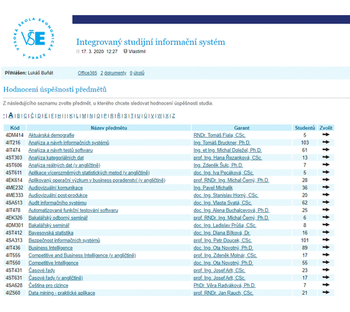

# INSIS grade grapher

It is a google chrome extention that allows users to see statistics for given courses from previous semesters. The course is specified by highlighting the course ident anywhere on insis.vse.cz domain.

## Pictorial description

## Installation

A link to chrome store to be added here.

## notes
-popis
-jak funguje
-icona - grafy
-nefunguje pokud neni presny format indentu?
-upravit kod + promenne
-cross platform - next elease

## Author
Lukas Bunat

## Contributing
Any ideas or suggestions are welcomed.

## License
None